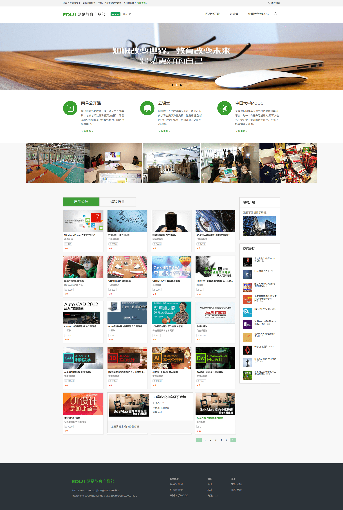

# 学习总结

## 导航

- [效果图](#效果图)

- [html 总结](#html-总结)

- [css 总结](#css-总结)

- [js 总结](#js-总结)

- [原作者错误处&不完善处](#原作者错误处&不完善处)

## 效果图

## html 总结

- 源代码中的代码模块化使用了如下的注释来进行标注:

        <!-- login -->
        <!-- /login -->

## css 总结

- index.css 采用了模块化的代码编写方式，方便代码复用和管理；

    - 并通过使用特殊的注释来便于区分；

- 模块化样式分析

    - `#loginModal` 样式总结

        - 布局分析

            - .m-modal 使用 `position: fixed;` & `z-index: 9999;`：

                - 使得其覆盖在其它元素之上；
                - 并成为 .bd 的 containing box；

            - .bd 使用 `position: absolute;` & `transform: translate(-50%, -50%);` 来实现水平和垂直居中；

        - 细节分析

            - input 元素配色搭配得非常巧妙，从 `background-color -> border -> box-shadow` 颜色逐层加深，搭配出来的效果比较的好看；
            - .submit 使用了 `radial-gradient` 和 `box-shadow` 实现了不错的效果；

    - `#videoModal` 样式总结

        - 布局分析

            - 使用和 `#loginModal` 一样的部分样式；

        - 细节分析

            - video 通过使用 `width: 100%;` 来实现了适当的大小设置；

    - `#tips` 样式总结

        - 布局分析

            - 垂直方向字体居中使用 `line-height`；
            - 使用 `@media` 实现了响应式宽度设置 & 设置 `margin: 0 auto` 实现水平方向居中效果；

        - 细节分析

            - 右浮动中的 `X` 符号通过多添加一个标签并设置背景图片实现；

    - `.g-hd` 样式总结

        - 布局分析

            - 通过 `.m-top` 样式设置了浮动盒子的范围，然后就是一个 `.f-fl` & `.f-fr` 左右浮动并排在一行；

        - 细节分析

            - `.f-fl`

                - `img` & `.attention > div` 都设置了浮动，这样其实就在一定程度上避免了基线对齐方面的问题了；
                - `.attention` 设置了 `line-height`，由于继承的原因，其子元素 `div` 都会继承这个样式，从而使得字体垂直居中；

                    - 其中的小图标都是通过多添加一个标签并设置背景图片实现的；
                    - `.dnc` 字体的水平居中是通过 `text-align: center`，`.hbfo` 字体的水平居中是通过设置 `padding` 来实现的；

            - `.f-fr`

                - `li` 元素的浮动设置，避免了基线对齐方面的问题；

                    - 其实原作者中的 `display` 设置是多余的，根据 `css spec` 得知一个元素一旦设置了 `float` 之后就 `display: block`；

                - 放大镜是通过多添加一个元素并设置背景图片实现的，并且 `hover` 的时候也是通过修改 `background` 属性来实现状态转换的；

    - `.m-sld` 样式总结

        - 布局分析：

            - 通过的是 `relative` 设置创建 `absolute` 定位时候的 `containing box` 来实现的；

    - `.m-snav` 样式总结

        - 布局分析

            - `li` 通过的是定宽和浮动来实现水平并列布局的；
            - `li` 中的左图右文字实现方式是：左图浮动，右边的文字设置 `margin-left` 来实现的；

        - 细节分析

            - `ul` 设置了负的 `margin` 值，这样就使得第一个 `li` 的 `padding-left` 值被抵消了，实现了内容靠边、中间设置 `padding` 的效果。

    - `.m-imgs` 样式分析

        - 布局分析

            - 通过的是背景图片的 `position` 来设置 `center top` 来实现的。

    - `.m-coursebd` 样式分析

        - 布局分析

            - 通过定宽和浮动，实现了 `.main` & `.side` 的左右两栏布局。

    - `.nav` 样式分析

        - 布局分析

            - `li` 左浮动并列到一行中；

        - 细节分析

            - `ul` 通过设置 `height` 这样也是一种清除浮动的方法；
            - `a` 设置 `display: block` 这样才可以将设置的 `padding` 算入到高度计算当中；

    - `.courselist` 样式分析

        - 布局分析

            - `li` 左浮动并定宽，再借助与 `main` 根据 `viewport` 改变宽度，这样就可以实现3、4列的布局效果；

        - 细节分析

            - `.tt` 通过如下的代码，实现了在文字过多的时候，实现隐藏。

                    overflow: hidden;
                    white-space: nowrap;
                    text-overflow: ellipsis;

            - `pnum` 通过设置 `background` & `padding` 来实现左侧的人物头像图片的设置，并且图片进行了一定的位置偏移。

    - `.suspend_course` 样式分析

        - 布局分析

            - `.suspend_course_main` 通过 `.logo` `.info` 的定宽并左浮动实现并排布局的效果；

        - 细节分析

            - `.pnum` 通过设置 `padding-left` & `background-image` 来实现左侧的小图片；

    - `.side` 样式分析

        - 细节分析

            - `.m-rmph li span` 左侧的小图片通过 `padding-left` & `background-image` 实现；

    - `.m-page` 样式分析

        - 布局分析

            - `li` 通过 `float: left` 实现布局；

        - 细节分析

            - `ul` 设置了高度，这样也是一种清除浮动的方式。
            - `a` 元素内容的水平和垂直居中是通过设置 `padding` 实现的，略微缺乏灵活，可以通过设置 `text-align: center` & `line-height` 来实现灵活的效果。

    - `.g-ft` 样式分析

        - 布局分析

            - 通过 `float` & 定宽实现4列布局；

        - 细节分析

            - 4列中行与行上下之间的距离都是通过 `margin-top` 来实现的；
            - `.weibo` 的小图标通过的是背景及其位置设置实现的；

## js 总结

- `util.js`：

    - 通过使用匿名函数 & `window` 作为参数传入，来实现模块化的代码组织方式；

- 顶部通知实现总结

    - 主要是借助 `cookie` & `click` 事件：

        - `click` 之后，就设置 `cookie`，然后通过 js 动态地添加样式 `display: none;` 实现元素的隐藏；

- 登录实现总结

    - 如果没有登录

        - 通过点击关注按钮，动态修改 `#loginModal` 的 `display` 值来实现登录框的显示和隐藏；
        - 当输入值后点击登录按钮，

            - 通过判断输入值的长度来看是否输入了值，

                - 如果有一个输入框没有输入值的话，就不发送 ajax 请求，并且通过修改输入框的样式来进行提示；
                - 如果输入值合法，就发送 ajax 请求

                    - 请求成功就设置 `cookie`，并且触发点击事件关闭登录框 & 修改 `#attention` 的 `class` 值进而替换显示已关注按钮；
                    - 如果请求失败，就弹出提示框；

    - 如果已经登录成功了（通过获取 cookie 来确定）

        - 就直接通过 `#attention` 的 `class` 值来替换显示已关注按钮；

- 轮播图实现总结

    - 核心原理：

        - 图片的显示和隐藏通过的是设置 `opacity` 来完成的；
        - 下面小圆点的更换是通过添加相应的 `class` 来实现的；

    - 初始化：

        - 首先将第一张图片的 `opacity` 设为 `1`，其它都是 `0`;
        - 讲第一圆点的 `class` 设置为 `z-show`;

    - 轮播：

        - `5000ms` 轮播一次，通过的是 `setTimeout`：

            - `switchDot` 修改圆点相应的 `class`；
            - `switchImg` 通过 `setTimeout` 来分 `time/interval` 来逐步改变图片的 `opacity` 样式的值；

    - `mouseover` 时 `clearTimeout` 取消轮播 ，`mouseout` 时以当前图片为第一图片重新开始进行轮播。

- 左侧内容区 Tab 切换实现总结

    - 核心原理

        - 通过在 `.nav` 的元素上绑定点击事件，通过 `ajax` 获取数据；然后将获取的数据，逐个创建元素并添加到 `dom` 中；
        - 每个创建的元素绑定了鼠标移入移出事件，

            - 当移入的时候，获取设置在元素上的 `data` 数据并创建元素，并设置相应的位置样式；
            - 当移出的时候，删除相应的元素；

- 视频弹框

    - 核心原理

        - 通过 `js` 操作元素的样式 `display: none` 来实现视频弹框的显示和隐藏。

- 热门推荐

    - 核心原理

        - 通过 `js` 操作元素的样式 & `setInterval` 实现每隔5秒钟的时间向上滚动一个热门元素，并且逐步向上移动元素，形成动画的效果；

## 原作者错误处&不完善之处

- index.html

    - `#loginModal`

        - from -> form;
        - h2 & a 中的登陆 －> 登录;

    - `.g-hd`

        - .u-icon-magnifiy -> .u-icon-magnify
        - .nav > li `display` 属性由于浮动的原因属于多余的设置；

    - `.m-sld`

        - `.m-sld .imgs .top` 的 `z-index: 1000` 是多余的，因为作者是通过 `opacity` 产生轮播效果的。
        - `.m-sld .dot`

            - `z-index` 设置也是多余的，根据同一层级中，后来居上的原则，`.dot` 会覆盖在 `.imgs` 上面。
            - `text-align` 设置也是多余的，绝对定位之后，元素就收缩了。

    - `.m-coursebd`

        - `.courselist>li>a>.logo` 由于 `strut` 的存在，基线对齐的原因，所以会在图片的下方产生一定的空白，可以通过 `display: block` 消除图片下方的空白。

- util.js

    - `addClass` & `removeClass`:

        - 问题： 由于作者在 `addClass` 使用了三元符号添加了一个空格，并且在 `removeClass` 中 `replace` 的时候也是使用一个空格进行替换的，所以就会产生两个空格。
        - 解决方案： 通过在 `removeClass` 中的 `forEach` 中替换之后添加 `oldClassName = oldClassName.trim()` 去掉了字符串两边多余的空格。

    - `getElementsByClassName`:

        - `else` 代码块中存在逻辑问题

                return function(oEl, sClass) {
                    if (arguments.length == 0) {
                        return ;
                    }

                    if (arguments.length == 1) {
                        sClass = oEl;
                        oEl = d;
                    }

                    var aEle = oEl.getElementsByTagName('*'),
                        arr = [];

                    forEach(aEle, function(item) {
                        classReg(sClass).test(item.className) && arr.push(item);
                    });

                    return arr;
                };

    - `getElementDataSet` 存在细节错误，代码修改如下：

            var getElementDataSet = util.getElementDataSet = function(el){
        		if(el.dataset) return el.dataset;
        		var oDataset = {};
        		forEach(el.attributes, function(item, i){
        			var name = el.attributes[i].nodeName;
           			if(datasetReg.test(name)){
        				oDataset[name.substring(5)] = el.attributes[i].value;
        		   }
        		})
        		return oDataset;
        	};

- index.js

    - 左侧内容区 Tag 切换

        - `mouseenterHandler`

            `detailNode.style.left =(divX-this.clientWidth-detailNode.width) + "px";` 这行代码无效； 修改如下:

                var flagProcessingwidth = true;
                if (parentWidth >= 980) {

                    if (dataset.index % 4 == 0) {
                        detailNode.style.left = (parentWidth - this.offsetLeft) + 'px';
                        flagProcessingwidth = false;
                    } else if (dataset.index % 4 == 3) {
                        flagProcessingwidth = false;
                    }
                } else if (parentWidth <= 735) {

                    if (dataset.index % 3 == 0) {
                        flagProcessingwidth = false;
                    }
                }
